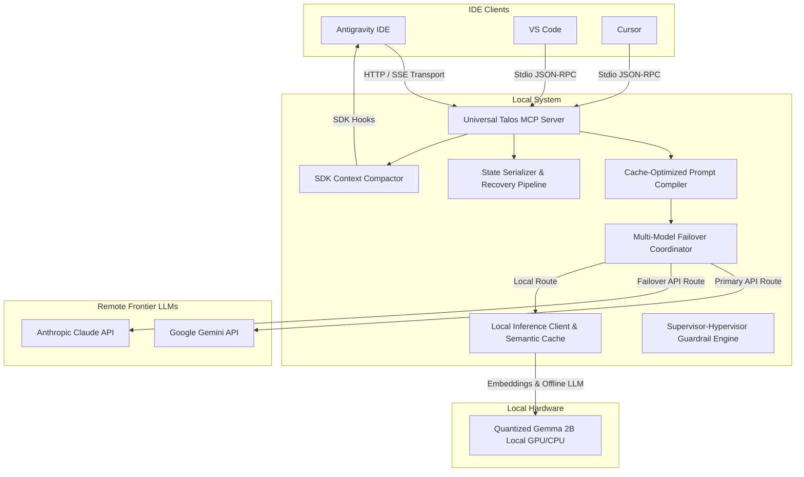

# System Architecture Blueprint: Talos AI Engineering Engine

This document defines the technical design, subsystem boundaries, data flows, and architectural choices for enhancing the Talos Autonomous AI Engineering Engine.

## 1. System Topology & Architectural Overview

The Talos engine is designed as an **IDE-agnostic, local-first hybrid-execution orchestrator**. Its core interface is decoupled from specific client front-ends using the **Model Context Protocol (MCP)**, allowing it to translate local system tools seamlessly to Antigravity, VS Code, and Cursor.

---

## 2. Component Specifications

### Component 1: Universal MCP Server & Auto-Config Installer
- **Stdio Transport Processor (`src/mcp/stdioTransport.ts`)**:
  - Standard JSON-RPC 2.0 processor reading from `process.stdin` and writing to `process.stdout`. Works out-of-the-box with VS Code and Cursor.
- **SSE HTTP Server (`src/mcp/sseTransport.ts`)**:
  - Node HTTP/Express-based Server-Sent Events listener bound to a dedicated local port (e.g. `3018`).
  - Implements the Antigravity-compatible configuration parameters including security auth-tokens, headers verification, and OAuth mock scopes.
- **Auto-Config Installer (`src/cli/mcpInstaller.ts`)**:
  - Dynamically runs on initialization to scan target directories:
    - **Antigravity config** is updated inside `~/.gemini/config/mcp_config.json`.
    - **VS Code/Cursor settings** are updated inside local AppData settings directories (e.g., global storage paths for popular extension adapters).

### Component 2: Cache-Optimized Prompt Compiler (`src/prompt/compiler.ts`)
- Builds LLM payloads with exact positioning to maintain a high KV cache hit rate.
- **Prefix Isolation Pipeline**:
  1. Gathers static system rules, identity constraints, and all active tool JSON definitions.
  2. Embeds explicit cache delimiter markers (`cache_control: {"type": "ephemeral"}`) after static sections for supporting backends (Claude).
  3. Formulates a strict, hard-coded dynamic separator: `=== DYNAMIC_TURN_SEPARATOR ===`.
  4. Appends dynamic runtime data (user instructions, active workspace file lists) after the separator.
  5. Places tool outputs inside a clean boundary to isolate volatile console outputs from heavy prefix contexts.

### Component 3: Local-First Inference & Semantic Cache
- **Local Router (`src/inference/router.ts`)**:
  - Determines task complexity. If a task requires routine analysis, local file operations, or minor code edits, it schedules execution through the local inference client.
- **Ollama / Llama.cpp Adapter (`src/inference/localClient.ts`)**:
  - Connects to `http://localhost:11434` or an embedded executor running Gemma 2B-IT in 4-bit, sending payload frames for offline execution.
  - **CPU-Only Execution Compatibility:** Quantized to 4-bit, the 2B model requires only ~1.5 GB of system memory (RAM). Utilizing modern CPU instruction extensions (AVX2, AVX-512, or ARM Neon) compiled natively by Ollama/llama.cpp, the execution achieves rapid token generation (15-30+ tokens per second) directly on general-purpose CPUs without requiring any dedicated GPU hardware. Gracefully falls back to CPU execution if no GPU is detected.
- **Semantic Vector Cache (`src/cache/semanticCache.ts`)**:
  - SQLite-backed fast vector lookup using a TF-IDF embedding or local lightweight transformer model.
  - Matches current user queries against historically resolved queries. If cosine similarity exceeds `0.85`, it instantly returns the cached result, reducing API traffic to zero.

### Component 4: SDK Context Compaction Hook (`src/sdk/compaction.ts`)
- Registers with the Antigravity SDK `onPostTurn` hooks.
- **Compaction Logic**:
  - Measures the token count $C_{active}$ of the active conversation array.
  - If $C_{active}$ exceeds the user-defined token budget $B_{token}$, it triggers compaction:
    1. Spawns a background sub-agent using the `research` subagent role.
    2. Instructs the sub-agent to summarize early conversation turns $1 \dots N-3$ without losing the primary technical decisions.
    3. Trims intermediate console logs and detailed tool call outputs from the history.
    4. Re-constructs the history array, ensuring the summarized turns replace the raw historical payloads.

### Component 5: Multi-Model State Preservation & Failover Pipeline
- **Workspace State Serializer (`src/resilience/serializer.ts`)**:
  - Prior to initiating any engineering turn, serializes active workspace buffers (lists of modified file paths and their uncommitted contents) to memory or `.talos/checkpoints/checkpoint.json`.
- **Failover Recovery Controller (`src/resilience/failover.ts`)**:
  - Intercepts error boundaries from primary model calls.
  - On catching "Agent terminated due to error" or API timeout on Linux:
    1. Reverts workspace changes by restoring uncommitted file states from the latest serializer checkpoint.
    2. Invokes context compaction to shrink the token payload.
    3. Re-routes execution using secondary cloud (Claude 3.5 Sonnet) or local Gemma models, preventing task abortion.

---

## 3. Architectural Decision Records (ADRs)

### ADR-001: Model Context Protocol (MCP) as the Core Integration Layer
- **Context:** Decoupling Talos from specific IDE ecosystems (VS Code, Cursor, and Antigravity) is required to prevent platform lock-in.
- **Chosen Option:** Packaging the core engine as a standalone MCP server supporting both stdio and SSE transports.
- **Rationale:** Stdio transport provides universal, instantaneous compatibility with Cursor and VS Code marketplace plugins. SSE transport enables secure HTTP-based OAuth and headers configurations required by Google's Antigravity 2.0.

### ADR-002: Exclude Tool Results Caching Strategy
- **Context:** Tool execution outputs vary widely between turns, which frequently invalidates cached prefixes, causing a total KV cache miss on provider-side APIs.
- **Chosen Option:** Implement a strict cache boundary separator where all dynamic tool executions are isolated at the end of the prompt payload, leaving system instructions, tool definitions, and project design rules strictly static at the payload header.
- **Rationale:** Reduces cloud API execution costs by up to 90% and latency by up to 85% by ensuring the heavy static prefix matches exactly on provider-side cache hits.

### ADR-003: SQLite-backed SQLite-VSS for Local Semantic Caching
- **Context:** Offline operations must resolve repeated query vectors locally with low footprint and no external database dependencies.
- **Chosen Option:** sqlite3 with local fast cosine distance matching.
- **Rationale:** Avoids heavyweight dependencies (e.g. dockerized databases), maintaining a zero-install, single-file local data strategy on the developer's machine.

---

## 4. Risks & Mitigations Registry

| Risk ID | Technical Risk | Severity | Mitigation Strategy |
| :--- | :--- | :--- | :--- |
| **RSK-01** | **Local Gemma 2B Reasoning Failures:** Local quantized Gemma models may fail on complex multi-step reasoning tasks. | Medium | **Hybrid Escalation:** Implement a router that delegates high-reasoning tasks strictly to cloud-hosted APIs (Gemini 3.5 Flash) while reserving local execution for routine syntax/file I/O. |
| **RSK-02** | **Merge Conflicts during Failovers:** Restoring state during failover may overwrite unsaved user modifications. | High | **Diff Pre-checks:** The state serializer captures changes in memory first, and the failover coordinator performs a soft-merge, displaying a structured diff in the Manager View before overwriting any local file. |
| **RSK-03** | **AppArmor Sandbox Blocks:** Linux Electron sandbox configurations can prevent the MCP server from executing node commands. | Medium | **Declarative AppArmor Installer:** Provide a dedicated bash installer to register appropriate local Electron policies and Custom Schema handlers on startup. |
